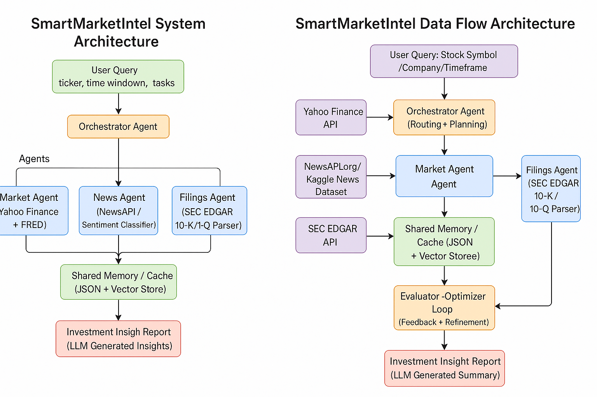

# SmartMarketIntel: Multi-Agent Financial Research System

**Course:** AAI-520 – Natural Language Processing & GenAI  
**University:** University of San Diego  
**Team 10:** Vikrant Tiwari (Lead), Ritesh Jain, Bhakti Kanungo

## Overview
SmartMarketIntel is a multi-agent financial intelligence system implementing Agentic AI patterns (Prompt Chaining, Routing, Evaluator–Optimizer, Cross-Run Memory). Agents collaborate to integrate market data, news sentiment, and SEC filings into a unified analysis bundle.

## Architecture


**Agents**
- MarketAgent: market metrics (Yahoo Finance/FRED)
- NewsAgent: news retrieval and sentiment
- FilingsAgent: SEC EDGAR parsing
- Orchestrator: planning and routing
- Evaluator: reflection (coverage, timeliness, coherence)
- Memory: cross-run cache for trend awareness

## Quick Start
1. Open `notebook/AAI_520_Final_Team_Project_Enhanced.ipynb` in Google Colab.
2. Install dependencies:
   ```bash
   pip install -r requirements.txt
